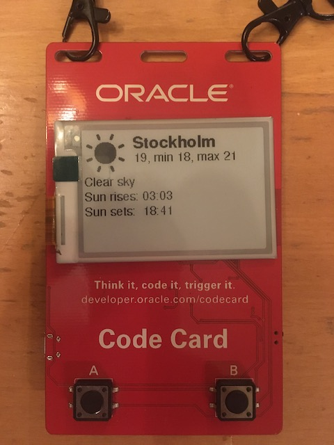

# Weather Codecard

This project contains a function that gets the weather forecast from an API. This function can be deployed to [Oracle Functions](https://docs.cloud.oracle.com/en-us/iaas/Content/Functions/Concepts/functionsoverview.htm) and consumed by the [Oracle Code Card](https://developer.oracle.com/codecard/).

## Prerequisites

* You need an Oracle Cloud Infrastructure (OCI) account, [sign up for a free trial if you don't have one already](https://myservices.us.oraclecloud.com/mycloud/signup?language=en).

* Sign up at [Open Weather Map](https://home.openweathermap.org/users/sign_up) and get your API key.

* [Follow the instructions](https://www.oracle.com/webfolder/technetwork/tutorials/infographics/oci_functions_local_quickview/functions_quickview_top/functions_quickview/index.html#) on how to set up your local environment for Oracle Functions.



## How to build

* Go to folder get_weather and insert your API key in func.js

* Deploy the function to OCI, [using your local fn environment](https://www.oracle.com/webfolder/technetwork/tutorials/infographics/oci_functions_local_quickview/functions_quickview_top/functions_quickview/index.html#): 

```cmd
fn -v deploy --app <app_name>
```

* Test that the function works by invoking it:

```cmd
fn invoke <app_name> get_weather
```

* To make your function available to the world, [create an API Gateway and connect it to your function](https://blogs.oracle.com/developers/creating-your-first-api-gateway-in-the-oracle-cloud). Official documentation is [here](https://docs.cloud.oracle.com/en-us/iaas/Content/APIGateway/Tasks/apigatewayusingfunctionsbackend.htm).

